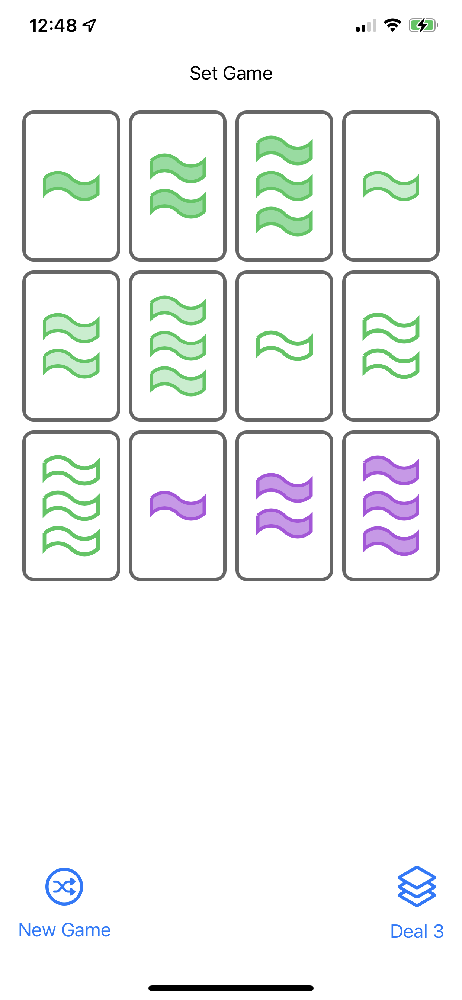
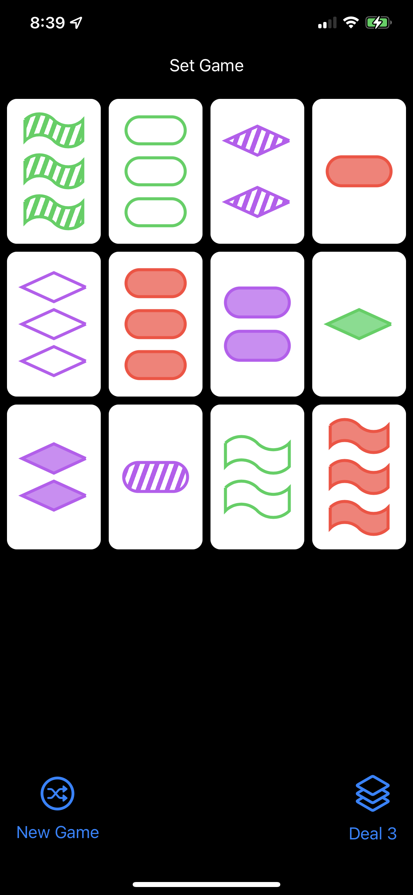
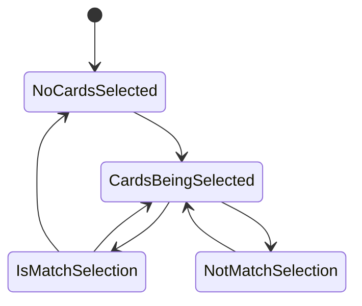

# Set Game

## Requirements

1. ❌ Implement a game of solo (i.e. one player) Set.
2. ✅ As the game play progresses, try to keep all the cards visible and as large as possible. In other words, cards should get smaller (or larger) as more (or fewer) appear on- screen at the same time. It’s okay if you want to enforce a minimum size for your cards and then revert to scrolling when there are a very large number of cards. Whatever way you deal with “lots of cards” on screen, it must always still be possible to play the game (i.e. cards must always be recognizable, even when all 81 are in play at the same time).
3. ✅ Cards can have any aspect ratio you like, but they must all have the same aspect ratio at all times (no matter their size and no matter how many are on screen at the same time). In other words, cards can be appearing to the user to get larger and smaller as the game goes on, but the cards cannot be “stretching” into different aspect ratios as the game is played.
4. ✅ The symbols on cards should be proportional to the size of the card (i.e. large cards should have large symbols and smaller cards should have smaller symbols).
5. ✅ Users must be able to select up to 3 cards by touching on them in an attempt to make a Set (i.e. 3 cards which match, per the rules of Set). It must be clearly visible to the user which cards have been selected so far.
6. ❌ After 3 cards have been selected, you must indicate whether those 3 cards are a match or mismatch. You can show this any way you want (colors, borders, backgrounds, whatever). Anytime there are 3 cards currently selected, it must be clear to the user whether they are a match or not (and the cards involved in a non-matching trio must look different than the cards look when there are only 1 or 2 cards in the selection).
7. ✅ Support “deselection” by touching already-selected cards (but only if there are 1 or 2 cards (not 3) currently selected).
8. ❌ When any card is touched on and there are already 3 matching Set cards selected, then ...
a. ❌ as per the rules of Set, replace those 3 matching Set cards with new ones from the deck
b. ❌ if the deck is empty then the space vacated by the matched cards (which cannot be replaced since there are no more cards) should be made available to the remaining cards (i.e. which may well then get bigger)
c. ❌ if the touched card was not part of the matching Set, then select that card
d. ❌ if the touched card was part of a matching Set, then select no card
9. ❌ When any card is touched and there are already 3 non-matching Set cards selected, deselect those 3 non-matching cards and select the touched-on card (whether or not it was part of the non-matching trio of cards).
10. ❌ You will need to have a “Deal 3 More Cards” button (per the rules of Set).
a. ❌ when it is touched, replace the selected cards if the selected cards make a Set
b. ❌ or, if the selected cards do not make a Set (or if there are fewer than 3 cards selected, including none), add 3 new cards to join the ones already on screen (and do not affect the selection)
c. ❌ disable this button if the deck is empty
11. ✅ You also must have a “New Game” button that starts a new game (i.e. back to 12 randomly chosen cards).
12. ✅ To make your life a bit easier, you can replace the “squiggle” appearance in the Set game with a rectangle.
13. ✅ You must author your own Shape struct to do the diamond.
14. ✅ Another life-easing change is that you can use a semi-transparent color to represent the “striped” shading. Be sure to pick a transparency level that is clearly distinguishable from “solid”.
15. ✅ You can use any 3 colors as long as they are clearly distinguishable from each other.
16. ✅ You must use an enum as a meaningful part of your solution.
17. ❌ You must use a closure (i.e. a function as an argument) as a meaningful part of your solution.
18. ❌ Your UI should work in portrait or landscape on any iOS device. This probably will not require any work on your part (that’s part of the power of SwiftUI), but be sure to experiment with running on different simulators/Previews in Xcode to be sure.

## Screenshots

* There is a `Shape` in the `CardView` that can draw squiggles (below) and diamonds:

* There is also code to add stripes in the background of cards, using a clipping mask

## Game Rules

[Set is a real-time card game] designed by Marsha Falco in 1974 and published by Set Enterprises in 1991. 

The deck consists of 81 unique cards that vary in four features across three possibilities for each kind
 of feature: 
 
 * number of shapes (one, two, or three), 
 * shape (diamond, squiggle, oval), 
 * shading (solid, striped, or open), and 
 * color (red, green, or purple).[1] 
 
Each possible combination of features (e.g. a card with three striped green diamonds) appears as a card
precisely once in the deck.

### Making a Set

In the game, certain combinations of three cards are said to make up a set. For each one of the four 
categories of features — color, number, shape, and shading — the three cards must display that feature 
as either 

* a) all the same, or 
* b) all different. 

Put another way: For each feature the three cards must avoid having two cards showing one version of the
feature and the remaining card showing a different version.

For example, 3 solid red diamonds, 2 solid green squiggles, and 1 solid purple oval form a set, 
because the shadings of the three cards are all the same, while the numbers, the colors, and the shapes 
among the three cards are all different.

## Attributions

* Set icon [from Wikipedia By Jeff Dahl, CC BY-SA 4.0](https://commons.wikimedia.org/w/index.php?curid=3306905]

[Set is a real-time card game]: https://en.wikipedia.org/wiki/Set_(card_game)

